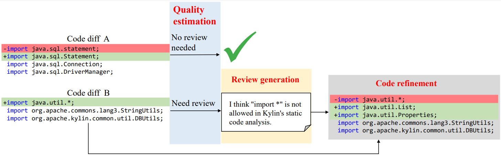

# CodeReviewProcesser

This repo is created to process the pull request database (refer to [ETCR](https://github.com/Lizhmq/etcr-infrastructure)) and generate the code review dataset.

Run:
```bash
cd process
bash process.sh
```

## Task Description

We create datasets for three downstream tasks:
* **Diff quality estimation**: predict whether a code change is well-written or need to be commented and improved.
* **Review generation**: generate code reviews for a code change automatically.
* **Code refinement**: revise the code based on a given code review.

Refer to our paper: [CodeReviewer](https://arxiv.org/abs/2203.09095) for more details.



## Source code

process/pull_file.py: query GitHub api for source code related to the comments in database.
* Query the database to find all comments. For each comment, select the related pull request (PR). Calculate the diff between current commit and the first commit in this PR. If the calculated diff matches with the diff stored in the comment database, this data is considered effective and stored in a new table.

process/create_cls_dataset.py: create the CLS dataset.
* Get the (comment, file) pair stored in the previous step. Collect all hunks in the diff, the commented hunk is labeled with 1 and the rest are labeled with 0.

process/create_gen_dataset.py: create the GEN dataset.
* Since msg is also stored in create_cls_dataset.py, I think we don't need this scirpt now.

process/create_ref_dataset.py: create the REF dataset.
* For each PRs, traverse each comment. A comment `R` is related to a hunk `D1`: C0->C1. If a later commit in this PR changes this file again with a hunk `D2`: C1->C2, and `D1` has intersection with `D2`, we assume that comment `R` contributes to the change `D2`: C1->C2. The data is used to create the refine dataset.


## Postprocess

Source code in directory `postprocess`.

To clean the dataset and distribute to `train/valid/test` set.